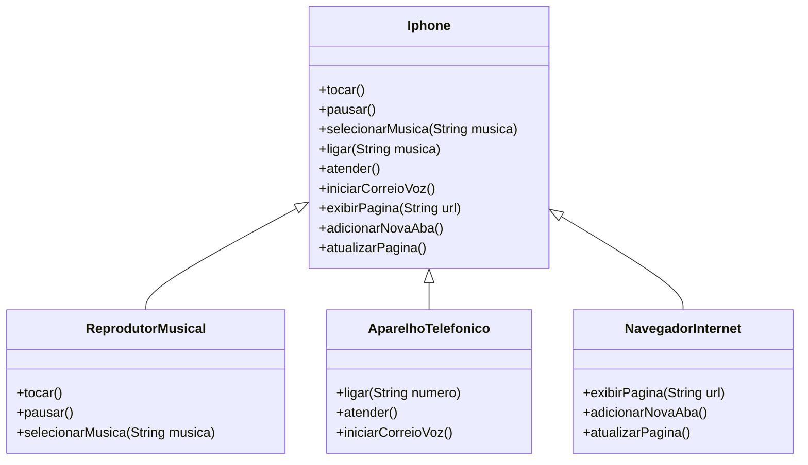

```mermaid
classDiagram
direction TB
    class ReprodutorMusical {
	    +tocar()
	    +pausar()
	    +selecionarMusica(String musica)
    }

    class AparelhoTelefonico {
	    +ligar(String numero)
	    +atender()
	    +iniciarCorreioVoz()
    }

    class NavegadorInternet {
	    +exibirPagina(String url)
	    +adicionarNovaAba()
	    +atualizarPagina()
    }

    class Iphone {
	    +tocar()
	    +pausar()
	    +selecionarMusica(String musica)
	    +ligar(String musica)
	    +atender()
	    +iniciarCorreioVoz()
	    +exibirPagina(String url)
	    +adicionarNovaAba()
	    +atualizarPagina()
    }

    Iphone <|-- ReprodutorMusical
    Iphone <|-- AparelhoTelefonico
    Iphone <|-- NavegadorInternet
```
